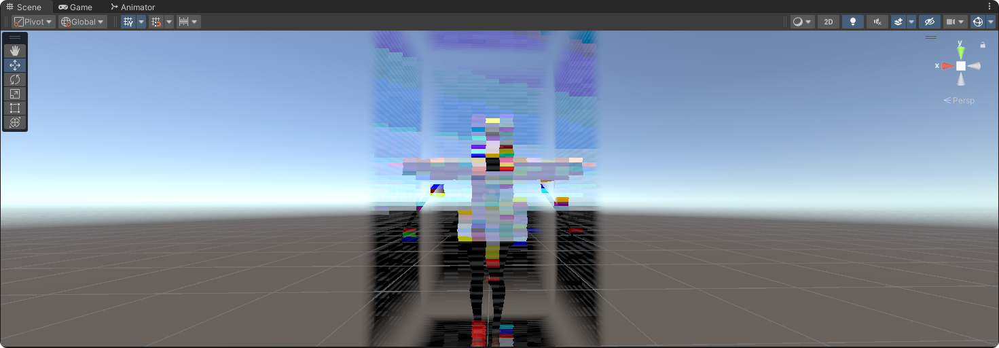
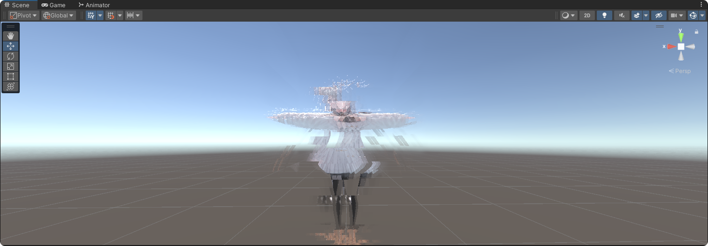
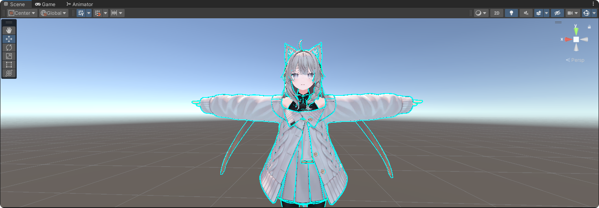
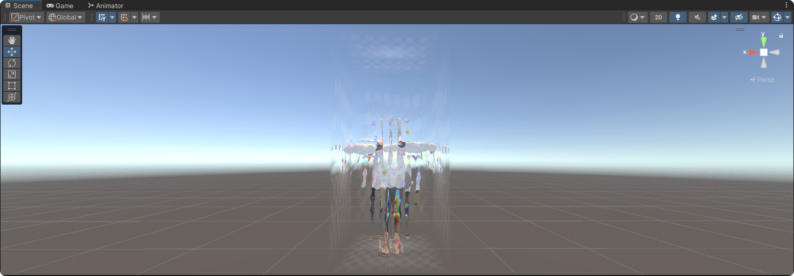

# PuddingKC VRChat Shaders

一个用于存放我练手 Unity 着色器的仓库，主要用于 VRChat，也可以用于任何其他用途。  
A collection of Unity shaders created for experimentation and fun, mainly for use in VRChat, but also suitable for other purposes.

> 你可以自由地在任何世界或虚拟形象中使用这些着色器，没有任何限制。  
> You are free to use these shaders in any worlds or avatars without restriction.  
> これらのシェーダーは、ワールドやアバターを問わず自由に使用できます。

# Preview

### Blur
> shaders/Effect_Blur.shader  
> *Animation effects

### Cognitive Pollution
> shaders/Effect_CognitivePollution.shader  
> *Animation effects

### Slice 2D
> shaders/Effect_Slice2D.shader  
> *Animation effects

### Rainbow Outline
> shaders/Effect_RainbowOutline.shader  
> *Animation effects

### Living Veil
> shaders/Effect_LivingVeil.shader  
> *Animation effects

